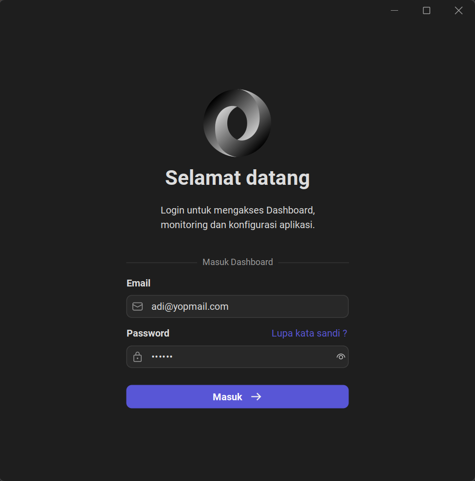

# FlatLaf UI Design

this project build using java swing with flatlaf and miglayout for modern UI.

### Login Form

## Minimum Project Requirement

- Login
- Menu
- 6 Form's (Master & Monitoring)
- 4 Report

## Compile Project
The Minimum java version is 21 - [Download Java 21](https://adoptium.net/temurin/releases/)

`mvn clean package -DskipTests=true`

## Run Project
`java -jar output-file.jar`

## Design References
- [FlatLaf Official Documentation](https://www.formdev.com/flatlaf/)

## Library Resources
- [FlatLaf](https://github.com/JFormDesigner/FlatLaf) - FlatLaf library for the modern UI design theme
- [MigLayout](https://github.com/mikaelgrev/miglayout) - MigLayout library for flexible layout management
- [Modal Dialog](https://github.com/DJ-Raven/swing-modal-dialog) - Modal Dialog library for create modal popup dialog
- [Datetime Picker](https://github.com/DJ-Raven/swing-datetime-picker) - Datetime Picker library for create datetime picker